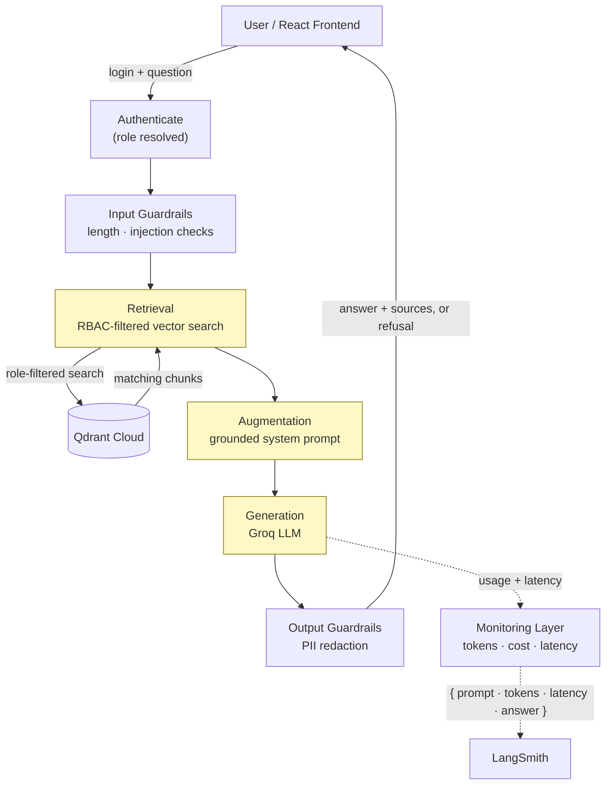

# FinSolve - AI document assisstant - A Role-Based Access Control System

## Business Problem

FinSolve Technologies, is a leading FinTech company providing innovative financial solutions and services to individuals, businesses, and enterprises.


1. FinSolve Technologies has company knowledge scattered across departments —  teams have been facing delays in communication and difficulty accessing the right data at the right time, which has led to inefficiencies. 
2. These delays and data silos between different departments like Finance, Marketing, HR, and C-Level Executives have created roadblocks in decision-making, strategic planning, and project execution. 

## Solution

To address these challenges, I have come up with an idea to develop a role-based access control (RBAC) chatbot to reduce communication delays, address data access barriers. 

This project buils an advanced Retrieval-Augmented Generation (RAG), and it enforces Role-Based Access Control (RBAC) *inside the retrieval step itself* — role-based AI assisstant that offers secure, department-specific insights on demand.

## Project Overview

The Project implements an advanced RAG system where logged-in user's role determines a fixed set of departments they're allowed to query. Every question first passes through input guardrails, then a Qdrant vector search that is filtered to *only* that role's allowed departments, then a grounded-answer prompt sent to an LLM, then output guardrails, before a cited answer is returned. Responses are evaluated for quality. The same pipeline is covered by an automated evaluation suite (RBAC-isolation probes, injection attempts, groundedness scoring) that gates every merge to `main` through GitHub Actions.

## System Architecture



### How a query actually flows

1. **Login** — the frontend sends the user's credentials via HTTP Basic Auth on every request; `authenticate()` in `app/services/auth.py` looks the username up in a fixed user table and returns their pre-assigned role. Roles are never chosen by the user.
2. **Input guardrails** — `check_input()` rejects empty or oversized messages and pattern-matches for prompt-injection attempts (e.g. "ignore previous instructions") *before* anything reaches retrieval or the LLM.
3. **RBAC-filtered retrieval** — `search_for_role()` embeds the question with the same model used at ingestion time, then queries Qdrant with a `Filter` restricting results to `metadata.department` values the role is allowed to see (`department_filter()` in `app/services/rbac.py`). Matches below a relevance-score threshold (`0.35`) are discarded as not actually relevant — this is what makes genuinely out-of-scope questions get refused instead of answered from a weak, irrelevant chunk.
4. **Grounded generation** — if any chunks survive, they're formatted with their source filenames and passed into a system prompt that instructs the model to answer *only* from that context and say so plainly if it can't. The prompt and question are sent to Groq's `openai/gpt-oss-120b`.
5. **Output guardrails** — `check_output()` scans the generated answer for PII-shaped text (email addresses, employee IDs) and withholds the response if the role isn't authorized for HR data — a defense-in-depth backstop behind RBAC, not a replacement for it.
6. **Observability** — every call's token usage and latency is appended to a local usage log for cost tracking, and the full prompt/response is traced in LangSmith.
7. **Response** — the answer, the *actual* source filenames retrieved (never trusted from the LLM's own claims), and a `blocked` flag are returned to the frontend, which renders blocked/refused answers with distinct styling.

## Key Features

### 1. Authentication
HTTP Basic Auth via FastAPI, with a fixed table of demo users in `app/services/auth.py`, each pre-assigned a role. A user proves *which* identity they are; they never get to assert a role themselves.

### 2. Role-Based Access Control
`ROLE_DEPARTMENTS` in `app/services/rbac.py` maps each role to the departments it may query. Every role also implicitly includes `general` (company-wide, non-sensitive info). Enforcement happens as a filter condition sent to Qdrant itself — a blocked department's data is never a candidate for retrieval, not merely hidden after the fact.

### 3. Document Ingestion
`app/services/ingest.py` walks every folder under `resources/data/`, treating the folder name as the department tag. Markdown files are split with `RecursiveCharacterTextSplitter` (800-character chunks, 100-character overlap); the HR CSV is read row-by-row and converted into `key: value` text blocks. Re-running ingestion deletes and rebuilds the Qdrant collection from scratch, so it's always idempotent.

### 4. Embeddings & Vector Search
Chunks are embedded locally with `sentence-transformers/all-MiniLM-L6-v2` (384 dimensions, no external API call, no per-embedding cost) and stored in **Qdrant Cloud** with a required payload index on `metadata.department` for fast filtering. Retrieval uses cosine similarity with a relevance-score cutoff.

### 5. Guardrails (defense-in-depth, alongside RBAC)
- **Input**: length limits, prompt-injection pattern detection.
- **Retrieval**: relevance-threshold cutoff for genuinely out-of-scope questions.
- **Output**: PII-pattern redaction for roles without HR access.

### 6. Evaluation Framework
`eval/dataset.py` defines 11 hand-written test cases spanning normal questions, RBAC-isolation probes, out-of-scope questions, and prompt-injection attempts. `eval/run_eval.py` runs each through the real production pipeline and checks for forbidden-department leakage and expected blocked/refused/answered behavior. For genuinely-answered cases, `eval/llm_judge.py` asks the same Groq model to score groundedness and relevance (1–5) via a structured grading prompt — a custom LLM-as-judge, not the Ragas library.

### 7. Cost & Token Monitoring
`app/services/monitoring.py` logs input/output tokens, an estimated cost (using Groq's published per-token pricing), and latency for every LLM call to `resources/usage_log.jsonl`. A `/usage` endpoint reports totals — restricted to the `c-level` role, consistent with the project's RBAC theme.

### 8. CI/CD
`.github/workflows/ci.yml` runs on every push/PR to `main`: a fast `pytest` suite (auth, RBAC mapping, guardrails — no network calls), then a slower job that rebuilds the Qdrant collection and runs the full evaluation suite. Branch protection requires both to pass before a merge is allowed.

## Tech Stack

| Layer | Technology | Why |
|---|---|---|
| Backend framework | FastAPI + Uvicorn | Async Python API framework with automatic docs (`/docs`) |
| LLM | Groq — `openai/gpt-oss-120b` | Free, fast inference; strong at instruction-following, which matters for staying grounded in retrieved context |
| Orchestration | LangChain (`langchain-groq`, `langchain-qdrant`, `langchain-text-splitters`, `langchain-huggingface`) | One consistent interface across the retrieval/prompt/generation chain |
| Embeddings | `sentence-transformers/all-MiniLM-L6-v2` | Free, runs locally, no API key required |
| Vector database | Qdrant Cloud | Metadata filtering at the query level (the mechanism RBAC relies on); cloud-hosted so it survives Cloud Run's stateless containers |
| Tracing/observability | LangSmith | Full prompt/response/token trace per request |
| Frontend | React 19 + Vite | Login, role display, chat UI, blocked-state styling |
| Testing | pytest | Fast, network-free unit tests for auth/RBAC/guardrails |
| CI/CD | GitHub Actions | Test + evaluation gates before merge |
| Containerization | Docker (`python:3.11-slim`) | Identical runtime locally and in the cloud |
| Deployment | Google Cloud Run + Secret Manager | Serverless container hosting; secrets never baked into the image |

## Security & Guardrails

| Mechanism | Layer | What it does |
|---|---|---|
| RBAC department filter | Retrieval | Blocked departments are never returned by the vector search — not hidden, structurally unreachable |
| Relevance threshold (`0.35`) | Retrieval | Weak/irrelevant matches are discarded instead of stuffed into the prompt as if relevant |
| Prompt-injection detection | Input | Regex patterns catch common override attempts ("ignore previous instructions", "reveal your system prompt", etc.) |
| Length/empty validation | Input | Rejects empty or oversized messages before they reach retrieval or the LLM |
| PII redaction | Output | Withholds responses containing email/employee-ID patterns for roles without HR access |
| Verified citations | Output | The `sources` returned to the user come from retrieval metadata, never from trusting the LLM's own claims about what it used |
| Role-gated cost data | Access control | `/usage` (token/cost report) is restricted to `c-level` |
| Branch protection + CI gates | Supply chain | No merge to `main` without passing tests and the RAG evaluation suite |

**Known, deliberate limitation**: user credentials are stored in plaintext in a hardcoded table (`app/services/auth.py`), not a database with hashed passwords. This project's focus is the RBAC/RAG retrieval architecture; see [Future Enhancements](#future-enhancements) for what a production auth system would need.

## What's Implemented vs. Future Enhancements

**Implemented and tested**: RBAC-filtered retrieval, guardrails, RAG pipeline with citation verification, automated evaluation, token/cost monitoring, CI/CD with merge gates, containerized cloud deployment.

**Future Enhancements** (not implemented — listed honestly, not as existing features):
- **Real user store** — a database (e.g. Firestore or Cloud SQL) with hashed passwords and an admin API, instead of a hardcoded plaintext table. Needed before new roles or users can be added without a code change and redeploy.
- **Hybrid search** — combining the current dense/semantic vector search with keyword-based (BM25-style) search, which would likely help with exact-match queries against the HR data's employee IDs and names.
- **Re-ranking** — a second-pass cross-encoder model to re-score top-k candidates; not currently needed at this corpus size (261 chunks), but would matter if the document set grew substantially.
- **Conversation memory** — each `/chat` request is currently fully stateless; there's no multi-turn context.
- **Response caching** — no exact-match or semantic cache exists yet; identical questions currently trigger a fresh vector search and LLM call every time.
- **Automated deployment** — CI currently gates merges but does not automatically deploy; `gcloud run deploy` is still run manually.
- **Deployed frontend** — the backend is live on Cloud Run; the React frontend currently runs locally (`npm run dev`) pointed at the live backend, and has not been deployed to static hosting.
- **Broader PII detection** — only email and employee-ID patterns are currently caught.

## Project Structure

```
rag-rbac-fintech/
├── app/
│   ├── main.py                  # FastAPI app: /login, /me, /chat, /usage endpoints, CORS
│   ├── config.py                # Loads and sanitizes environment variables
│   └── services/
│       ├── auth.py              # HTTP Basic auth + hardcoded user/role table
│       ├── rbac.py              # Role → allowed departments; Qdrant filter + relevance threshold
│       ├── ingest.py            # Chunking, embedding, and loading documents into Qdrant
│       ├── guardrails.py        # Input validation, injection detection, output PII redaction
│       ├── rag.py               # Ties retrieval + prompt + LLM + guardrails together
│       ├── llm.py               # Groq client (openai/gpt-oss-120b)
│       └── monitoring.py        # Token usage, cost estimation, usage log
├── eval/
│   ├── dataset.py                # Hand-written evaluation cases
│   ├── run_eval.py               # Runs cases through the real pipeline, checks RBAC/guardrail behavior
│   └── llm_judge.py              # LLM-as-judge groundedness/relevance scoring
├── tests/                        # pytest: auth, RBAC mapping, guardrails (no network calls)
├── resources/data/<department>/  # Source documents, one folder per department
├── frontend/                     # React + Vite chat UI
├── Dockerfile                    # Backend container image
├── .github/workflows/ci.yml      # Test + evaluation CI gates
└── pyproject.toml                # Dependencies and build config
```

## Getting Started

### Backend

```bash
git clone https://github.com/Sathwika-2k3/rag-rbac-fintech.git
cd rag-rbac-fintech

python -m venv .venv
.venv\Scripts\Activate.ps1        # Windows PowerShell

pip install -e ".[dev]"

cp .env.example .env              # then fill in real values below
```

Required environment variables (see `.env.example`):

| Variable | Purpose |
|---|---|
| `GROQ_API_KEY` | LLM access — free key at [console.groq.com](https://console.groq.com) |
| `QDRANT_URL`, `QDRANT_API_KEY` | Vector database — free cluster at [cloud.qdrant.io](https://cloud.qdrant.io) |
| `LANGCHAIN_API_KEY`, `LANGCHAIN_TRACING_V2`, `LANGCHAIN_PROJECT` | Optional LangSmith tracing |

Load the documents into Qdrant, then start the API:

```bash
python -m app.services.ingest
fastapi dev app/main.py
```

The API is now at `http://127.0.0.1:8000` — interactive docs at `/docs`.

### Frontend

```bash
cd frontend
npm install
npm run dev
```

Opens at `http://localhost:5173` (or the next free port). Update `API_BASE` in `frontend/src/App.jsx` to point at your own backend if not running locally.

### Tests and evaluation

```bash
pytest tests -v            # fast, no network calls
python -m eval.run_eval    # full pipeline: RBAC isolation, guardrails, groundedness
```

### Docker

```bash
docker build -t finsolve-backend .
docker run -p 8080:8080 --env-file .env finsolve-backend
```

## Roles and Permissions

| Role | Can Access | Example Question |
|---|---|---|
| `general` | General only | "What's the holiday policy?" |
| `engineering` | Engineering + General | "What's our deployment process?" |
| `finance` | Finance + General | "What was covered in the quarterly financial report?" |
| `marketing` | Marketing + General | "How did the Q2 2024 campaign perform?" |
| `hr` | HR + General | "What is the leave policy?" |
| `c-level` | Everything | "Give a summary of engineering's development process." |

## Sample Users

These are demo credentials, intentionally hardcoded in `app/services/auth.py` for local testing — not real accounts.

| Username | Password | Role |
|---|---|---|
| Tony | password123 | engineering |
| Peter | pete123 | engineering |
| Bruce | securepass | marketing |
| Sid | sidpass123 | marketing |
| Sam | financepass | finance |
| Natasha | hrpass123 | hr |
| Wanda | wandapass123 | general |
| Nick | nickpass123 | c-level |

### Query Samples

1. What's our engineering deployment process? -- Engineering
2. What is Aadhya Patel's salary? -- HR
3. What was covered in the quarterly financial report? -- Finance
4. How did the Q2 2024 campaign perform? -- Marketing
5. What is the leave policy? -- General
6. Give a summary of engineering's development process. -- C-Level

### NOTE

Trying question 2 with `Sid` (marketing) credentials instead of `Natasha` (HR) returns an empty `sources` list and a plain refusal — the RBAC filter never lets the marketing account's search touch HR data in the first place.


## Deployment

The backend is live on **Google Cloud Run**:

```
https://finsolve-backend-261456487410.southamerica-east1.run.app
```

- Containerized with the repo's `Dockerfile`, built and deployed via `gcloud run deploy --source .`
- Secrets (`GROQ_API_KEY`, `LANGCHAIN_API_KEY`, `QDRANT_API_KEY`) are stored in **GCP Secret Manager**, not baked into the image
- Vector storage uses **Qdrant Cloud** rather than local storage, since Cloud Run's filesystem is stateless and doesn't persist across container instances or restarts
- CORS is configured to allow local development origins and the project's Firebase Hosting domain (reserved for a future frontend deployment)

The frontend is not yet deployed to static hosting — see [Future Enhancements](#future-enhancements).
